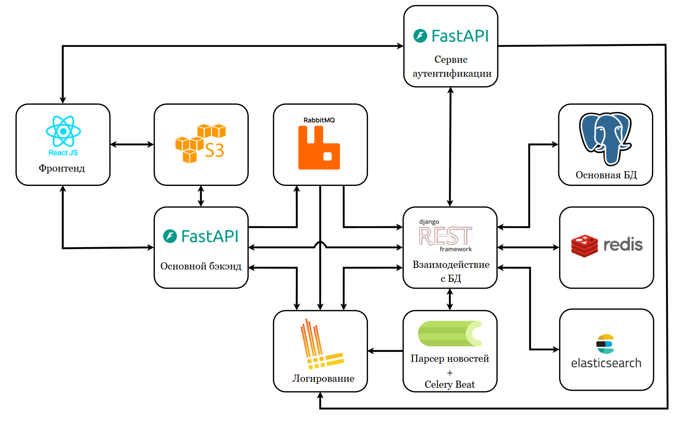

# Агрегатор новостей.
## Описание:
    Проект представляет собой web-приложение, задачей которого является агрегация новостей, включающая в себя: сбор из открытых источников, хранение и выдача пользователям.
    Для возможности взаимодействия пользовтеля с приложением реализованы 2 типа интерфесов: web-интефейс и web-api.
## Стек:
* Python 3.13
* Fastapi + pydantic
* DRF
* Celery + Celery Beat
* Postgresql
* Elasticsearch
* Redis
* RabitMQ
* Minio
* React (js, html, css).
* Docker + Docker Compose
* Nginx
* Loki + Grafana + Prometheus
* и другие.

---

# Дисклеймер!
    Данный репозиторий представляет собой pet-проект. 
    Важно понимать, проект разработан с такими целями как: тренировка навыков и демонстрация возможностей при разработке web-приложений с релевантным стеком, с акцентом на backend.
    Стоит отметить, что в проекте намерено упрощены или усложенены некоторые компоненты логики. В том использование излишнего числа сервисов.
    Усложнение обусловлено желанием охватить как можно больше(в рамках разумного) технологий при разарботке.
    Также имеет место быть упрощение логики работы сервисов, по причинам, описанным выше.
    Таким образом построенная архитектура не является оптимальной для реального проекта и носит лишь демонстрационный характер.

--- 

# Структура проекта.


## Реализовано 5 микросервисов:
1. [backend](backend) - "Основной бэкэнд";
2. [db-service](db-service1) - сервис, назначением которого является взаимодействие с несколькими СУБД;
3. [auth-service](auth-service) - сервис, включающий в себя авторизация, аутентификацию и регистрацию пользователей;
4. [news-parser](news-parser) - представляет собой скрипт для парсинга новостей с определенных внешних ресурсов;
5. [logging-service](logging-service) - сервис, агрегирующий в себе логи со всех, описанных выше микросервисов;

## Взаимодействие между сервисами осуществляется с использованием архитектурного стиля взаимодействия [REST](https://ru.wikipedia.org/wiki/REST).

## Дерево проекта:
```
news-agregator
```
